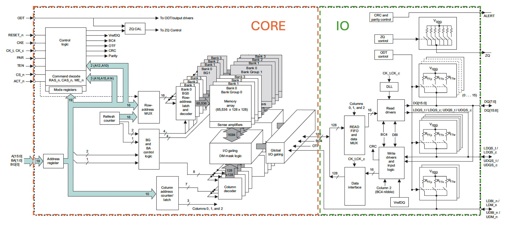

#DDR5

##New Features

###Higher Speed

###Lower Voltage

###Pin

####Power and VREF
|  Pins  |      DDR1      |   DDR2    |      DDR3      |      DDR4      |   DDR5    |   Comments    |
| :--------: |:-------------:| :---------:| :---------:| :--------: | :-------------:| :---------:|
| VDD | 2.5V| 1.8V| 1.5V | 1.2V | 1.1V | Core Power Supply |
| VSS | GND| GND | GND | GND | GND | Ground |
| VDDQ  | 2.5V | 1.8V | 1.5V | 1.2V | 1.1V | DQ Power Supply |
| VSSQ | GND| GND | GND | GND | Not Present | DQ Ground |
| VDDL | Not Present | 1.8V | Not Present | Not Present | Not Present | DLL Power Supply |
| VSSDL | Not Present | GND | Not Present | Not Present | Not Present | DLL Ground |
| VPP | Not Present | Not Present | Not Present | 2.5V | 1.8V | DRAM Activating Power Supply |
| VREF | Present | Present | Not Present | Not Present | Not Present | Reference Voltage used for both CA and DQ lines |    
| VREFCA | Not Present | Not Present | Present | Present | Present | Reference Volatge for Control, Command and Address lines |
| VREFDQ | Not Present | Not Present | Present | Not Present | Not Present | Reference Volatge for Data lines |

#####VDD, VSS - DRAM Core Power Supply and Ground.  
1. This is used to power the core block logic in the DRAM for eg. Address Decoder, Banks etc. 
2. As you can observe that with each generation, Voltage has been decreased leading to better power saving.

#####VDDQ, VSSQ - DRAM DQ Power Supply and Ground.
1. This is separate from VDD and VSS because isolating them improves noise immunity. 
2. This is used to power the IO blocks which include the receiver, drivers etc.

Following image shows the Core vs IO block on DDR4
> **Taken from Micron DDR4 MT40A512M16 - 512 Meg x 16 Functional Block Diagram**
> {: small"}

####VDDL, VSSDL - DLL Power Supplu and Ground
1. These pins are only used on DDR2. I am not shure why they were explicitly created on DDR2 and then removed on DDR3. But they are used for DLL and is 1.8V on DDR2.
   
####VPP - DRAM Activation Power Supply.  
1. Up until DDR3, we had charge pump inside the DRAM devices but they were inefficient. So from DDR4 onwards, we have charge pump inside the DDR devices which are used to supply power when activation command is issued.
2. VPP is the power supply used by the charge pump when it received activation command.

####VREF, VREFDQ and VREFCA
1. DDR1 uses SSTL_2 for both CA and DQ, and external VREF pin provides SSTL_2 reference volatge for both CA and DQ.
2. DDR2 uses SSTL_18 for both CA and DQ, and external VREF pin provides SSTL_18 reference voltage for both CA and DQ.
3. DDR3 uses SSTL_15 for both CA and DQ lines, and  external VREFCA and VREFDQ pins provide SSTL_15 reference voltage for CA and DQ respectively.
4. DDR4 use SSTL_12 for CA and POD_12 for DQ lines. VREFCA is external physical pin and provides SSTL_12 reference voltage for CA lines. Reference voltage for POD_12 used by DQ lines is generated internally and is selected through Mode Register.
5. DDR5 uses POD for both CA and DQ, and VREFCA and VREFDQ is internally generated and is selected through Mode Register.
6. VREF/VREFCA when used for CA lines is used for all Control, Command and Address signals.
7. It should be noted that when VREFCA is externally provided then it should be maintained at all times (including Self Refresh) and when VREFDQ is externally provided then it should be maintained at all times (excluding Self Refresh). If there is single external VREF pin then it should always be maintained since it is shared by CA and DQ.

####Clock, Command and Control
|  Pins  |      DDR1      |   DDR2    |      DDR3      |      DDR4      |   DDR5    |   Comments    |
| :--------: |:-------------:| :---------:| :---------:| :--------: | :-------------:| :---------:|
| CK_t/CK, CK_c/CK#  | CK, CK# | CK, CK# | CK, CK# | CK_t, CK_c| CK_t, CK_c | Differential Clocks |
| CKE | Present | Present | Present | Present | Not Present | Clock Enable |
| CS_n | Present |     Not Present | Chip Select |
| Command Address |   A0-A17    |      CA0-CA13 |  |
| ACT_n |   Present    |      Not Present | Activation Command Input |
| Bank Group | BG0-BG1 |     Not Present | Bank Group |
| Bank Address | BA0-BA1 |     Not Present | Bank Address |
| CAI | Not Present |     Present | Command Address Mirroring |
| ODT | Present |     Not Present | On-Die Termination Pin |

####CK_t,CK_c (or CK,CK#) - Differential Clocks
1. On DDR1, DDR2, DDR3 they use CK,CK# but DDR4, DDR5 uses CK_t,CK_c (True and Complement).
2. They are differential clock inputs and all address and control signals are sampled on crossing of the positive edge of CK_t(CK) and negative edge of CK_c(CK#).
3. On DDR1, DDR2 - output data (DQ and DQS) is referenced to crossing of CK & CK#. On DDR3 - output data strobe (DQS) is referebced to crossing of CK & CK#.
4. Data is not referenced to clocks but is referenced to the Data Strobe (DQS_t,DQS_c)

####CKE - Clock Enable
1. CKE is not present on DDR5 but is presnet on all previous generations of DDRs.
2. CKE HIGH activates and CKE LOW deactivates the internal clock, input buffers and output drivers. So you can understand that on DDRs where CKE is used, it should remain high throughout the Read, Write operations.
3. CKE is also used for Power Down and Self Refresh operations. Taking CKE LOW provides Precharge PD, Active PD, Self Refresh operations.
4. CKE is synchrnous for PDE and PDX and SRE. CKE is asynchronous for SRX.

####Data, Data Strobes, Data Mask
|  Pins  |      DDR4      |   DDR5    |   Comments    |
| :--------: |:-------------:| :---------:|:---------:|
| DQ  | Present |     Present | Data |
| DQS_t, DQS_c,   DQSU_t, DQSU_c   DQSL_t, DQSL_c |   Present    |       Present | Data Strobe |
| TDQS_t, TDQS_c | Present |     Not Present | Termination Data Strobe |
| DM_n |   A0-A17    |      CA0-CA13 | Data Mask |
| DBI_n |   Present    |      Not Present | Data Bus Inversion |

####Miscellaneous
|  Pins  |      DDR4      |   DDR5    |   Comments    |
| :--------: |:-------------:| :---------:|:---------:|
| ZQ  | Present |     Present | Data |
| LBDQ |   Not Present    |       Present | Loopback Data Output |
| LBDQS | Not Present |     Not Present | Loopback Data Strobe |
| TEN |   Present    |      Present | Connectivity Test Mode |
| ALERT_n |   Present    |      Not Present | Data Bus Inversion |
| RESET_n | Present |     Present |  |

####DIMM Pins
|  Pins  |      DDR4      |   DDR5    |   Comments    |
| :--------: |:-------------:| :---------:|:---------:|
| VTT  | Present |     Present |  |
| VDDSPD |   Present    |       Present |  |
| V_12, V_BULK | Present |     Present |  |
| SCL |   Present    |      Present |  |
| SDA |   Present    |      Present |  |
| SA | Present |     Present |  |

###DIMM Architecture
###Burst Length
DDR5 supports BL16 as native option. It also supports BC8 OTF, Fixed BL32, BL32 OTF (OTF = On the Fly). In comparison, DDR4 used BL8 as native option but also supported Fixed BC4, BC4 OTF and BL8 OTF.

##Pin Description

###Power and VREF

####VDD, VSS
DDR Core Power and Ground.
Present in both DDR4 and DDR5.

####VDDQ, VSSQ
DDR IO Power and Ground for Data Group Signals.
VDDQ is present in both DDR4 and DDR5. However, VSSQ is not mentioned in DDR5 JEDEC spec.
VSSQ is separate from VSS for improved noise immunity.

####VPP
1. VPP is the DRAM Activation Power Supply.  
2. Up until DDR3, we had charge pump inside the DRAM devices but they were inefficient. So from DDR4 onwards, we have charge pump inside the DDR devices which are used to supplu power when activation command is issued.

####VREFDQ and VREFCA
1. DDR3 uses SSTL for both DQ and CA lines, and they use an external VREFDQ and VREFCA reference voltage which is VDD/2.  
2. DR4 use POD for DQ and SSTL for CA, and VREFCA is external pin and VREFDQ is internally generated.  
3. DDR5 uses POD for both DQ and CA, and VREFDQ and VREFCA is internally generated.  

###Clock, Command and Control

###Data, Data Strobes, Data Mask

###Miscellaneous

####ZQ
1. ZQ pin is present in all DDR3, DDR4 and DDR5.
2. It is tied to 

###DIMM Pins

##Trainings
###Command Bus Training
Command Bus Training has been added to DDR5. It is derived from LPDDR4 but is slighlty different from LPDDR4. It consists of 2 trainings:
1. CS Training
2. CA Training
###Read Preamble Training
###Write Leveling (External + Internal)
###Read Training
###Write Training
