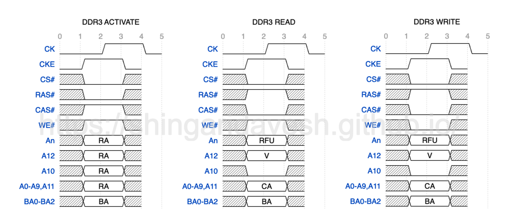
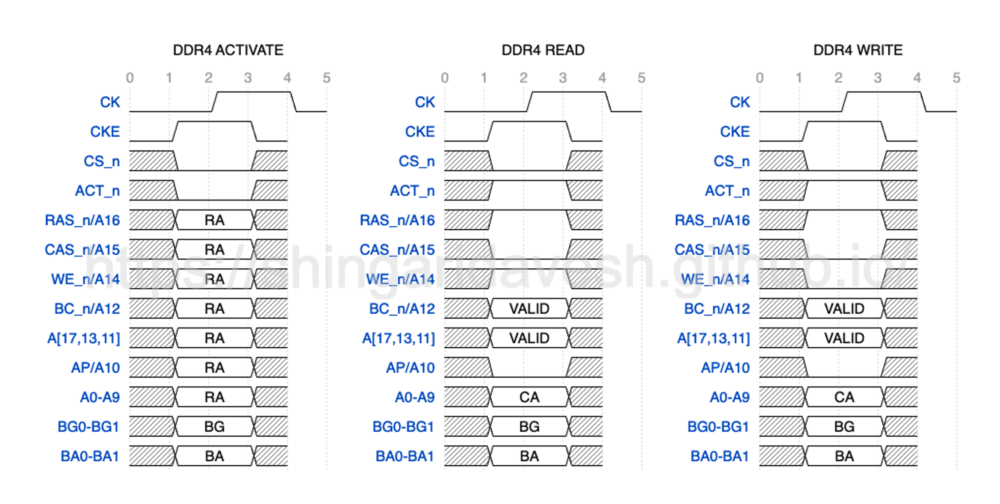
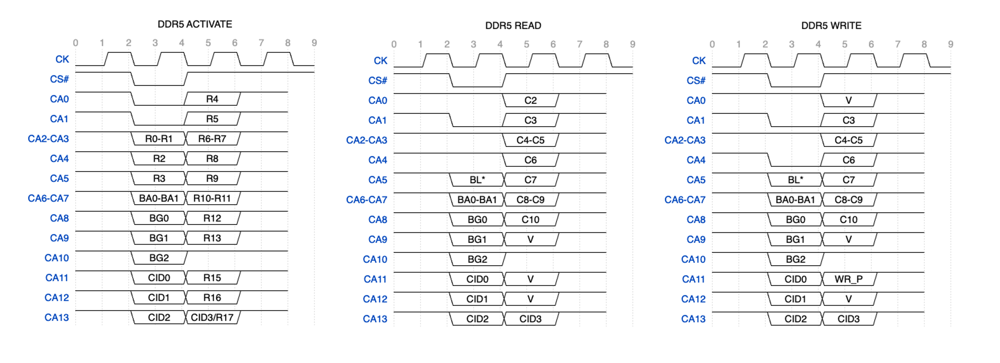

#Miscellaneous Topics

##History of RAS, CAS, WE and ACT

To understand the history, we first need a refresher on how Read/Write operation works on DDRs. Before we can issue Read or Write command to a bank, we first need to ACTIVATE i.e. bring the desired Row into the sense amplifier. Once the row is open/activated, we can issue Read or Write command.

> **DDR3 Activation, Read and Write**
> 

> **DDR4 Activation, Read and Write**
> 

> **DDR5 Activation, Read and Write**
> 
