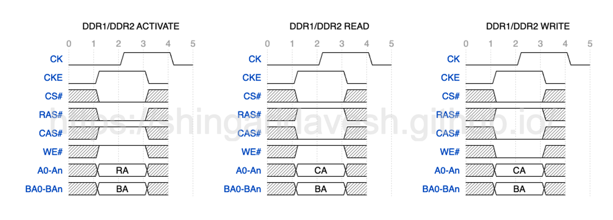

#Miscellaneous Topics

##History of RAS, CAS, WE and ACT

To understand the history, we first need a refresher on how Read/Write operation works on DDRs. Before we can issue Read or Write command to a bank, we first need to ACTIVATE i.e. bring the desired Row into the sense amplifier. Once the row is open/activated, we can issue Read or Write command.

So to summarize we can cateorize the actions into 2 steps:
1. Activate:  
   a. We need to tell DRAM first that it is an Activate command.  
   b. Along with that we need to tell the DRAM Row Address, Bank Number and Bank Group (if applicable)  
3. Read/Write:  
   a. We need to tell DRAM that it is an Read or Write command.  
   b. Along with that we need to tell the DRAM Column Address, Bank Number and Bank Group (if applicable)  
   
> **DDR1/DDR2 Activation, Read and Write**
> 

> **DDR3 Activation, Read and Write**
> 

> **DDR4 Activation, Read and Write**
> 

> **DDR5 Activation, Read and Write**
> 
