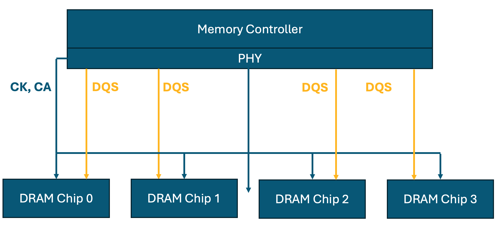

#Trainings

##Commanmd Bus Training
##Write Leveling
To understand what Write Leveling does and why we need it, we need to start with DDR topology. So little bit of history lesson. Up until DDR2, we used to use T Topology to place the DDR chips, but from DDR3 onwards, we started using Fly-by Topology. If you don't understand, just wait for some time. 
1. T Topology - In T topology all the DDR devices are placed at same distance from the Memory-Controller/PHY. In this topology, Clock, Command and Address fanout from the Memory-Controller/PHY into a T and is connected to the 2 DRAM device. If there are 4 devices, then each branch of T is split again into 2 more T branches and each branch is connected to DRAM devices. Image below shows the different configuration. 
2. Fly-by Topology - In Fly by topology all the DRAM devices are placed serially, in daisy chain fashion. In this toplogy, Clock, Command and Address fanout from the Memory-Controller/PHY and routes to Chip 0, then Chip 1 and continues to Chip N. Image below shows the configuration. 
> :camera: **Fly-by Toplogy with 4 DRAM devices**
> {.center .small}

##Vref-Read Training
##Vref-Write Training
